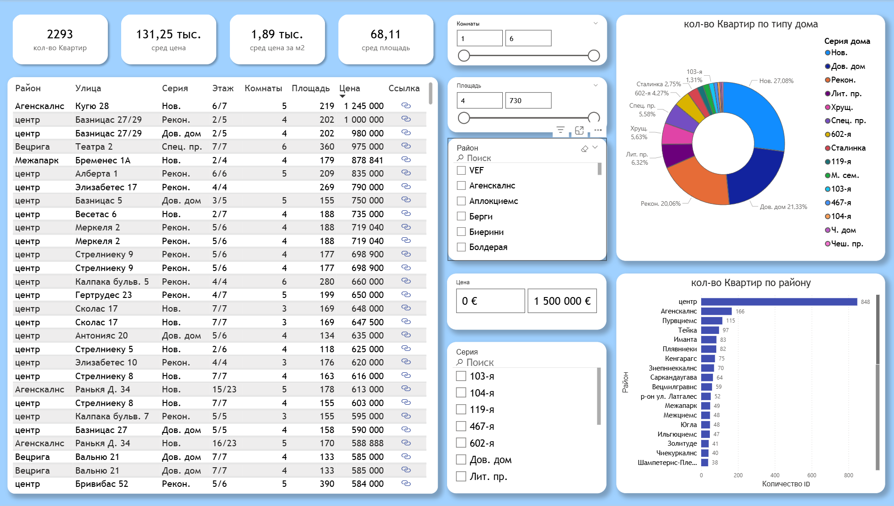
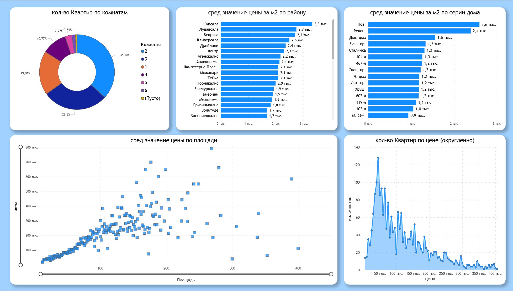

# 🏠 Riga Real Estate Market Analysis (Power BI)

An analytical dashboard designed to find undervalued apartments and analyze housing costs across different districts of Riga (city center, residential areas).

## 🎥 Demo

## 📊 Screenshots
| Main Dashboard | Price Analysis (Scatter Plot) |
| :---: | :---: |
|  |  |

## 🛠 Technical Implementation

### 1. Data Collection (Python) 🐍
* Developed a **custom web scraper** to collect real estate data from **ss.lv**.
* **Stack:** Python, `requests`, `BeautifulSoup`, `lxml`.
* Extracted key attributes: price, area, street, floor, and house series.

### 2. ETL (Power Query)
* **Data Cleaning:** Removed currency symbols, formatted numeric fields, and handled missing values.
* **Geocoding:** Created full address strings (`Street` + `"Riga, Latvia"`) to enable precise mapping in Bing Maps.

### 3. Data Modeling & DAX
* **Measures:** Calculated dynamic metrics, including Average Price per m²:
    `DIVIDE(SUM(Price), SUM(Area))`
* **KPIs:** Setup dynamic cards to track market averages based on selected filters.

### 4. Visualization
* **Interactive Map:** Bing Maps integration with street-level detail.
* **Scatter Plot:** Used to identify anomalies (undervalued properties) by correlating Price vs. Area.
* **Slicers:** Advanced filtering by District, Room Count, and Budget.

## 🚀 How to Run
*Note: Due to organizational security policies, the "Publish to Web" feature is disabled.*

1.  Download the file [parser.pbix](parser.pbix) from this repository.
2.  Open it in **Microsoft Power BI Desktop**.

---
*Data sourced from public listings.*
